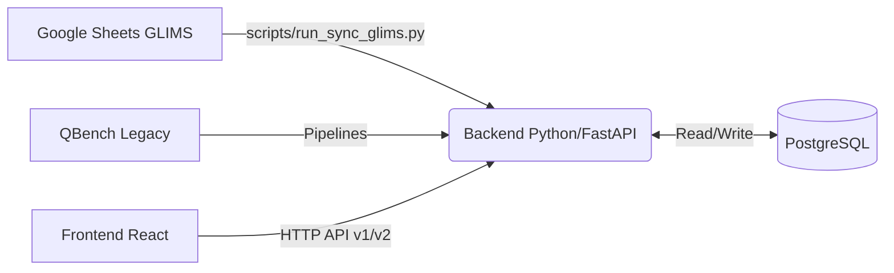
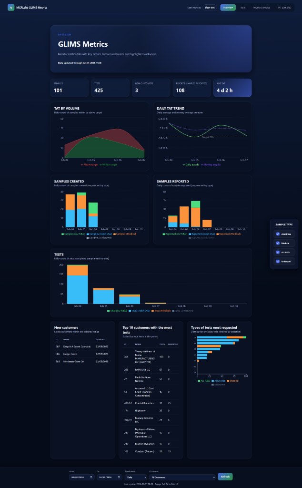
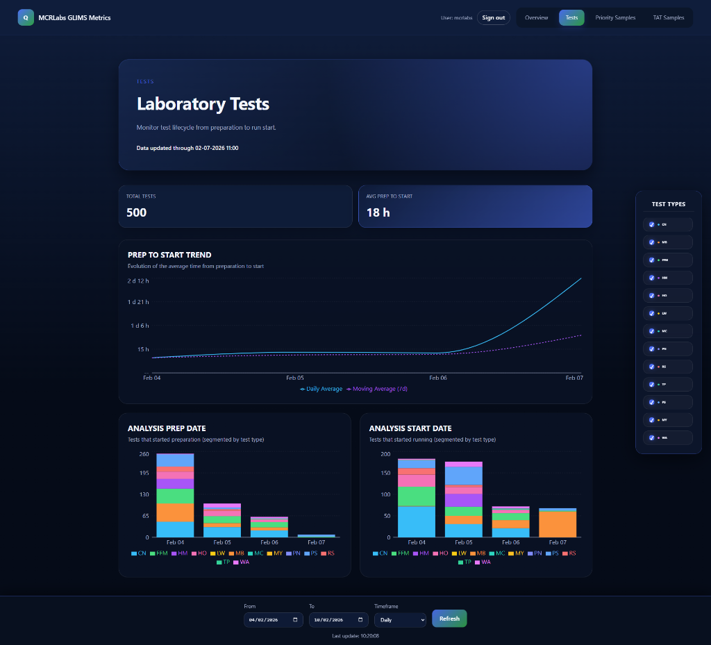
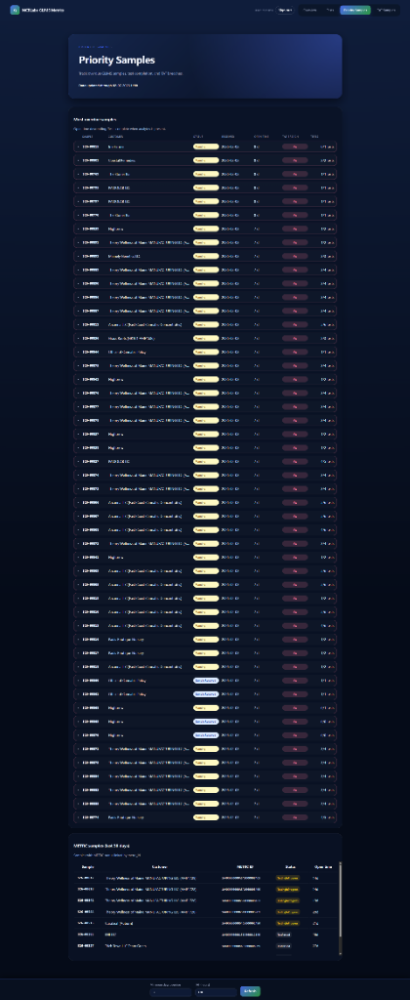

# 📊 MCRLabs Dashboard (QBench + GLIMS)

## 💡 Sobre el Proyecto
Este sistema es el centro de control para las operaciones de laboratorio de MCRLabs. Su objetivo principal es unificar la información de dos fuentes distintas:
1.  **QBench (Legacy):** El sistema histórico de gestión.
2.  **GLIMS (Google Sheets):** El nuevo flujo operativo ágil.

El Dashboard permite a los gerentes y analistas visualizar métricas clave como el **Tiempo de Respuesta (TAT)**, el volumen de muestras procesadas y detectar cuellos de botella en tiempo real, todo en una interfaz web moderna y rápida.

---



## Tecnologías
- Python 3.12, FastAPI, SQLAlchemy, pandas, httpx, gspread
- PostgreSQL
- React + TypeScript + Vite

## Requisitos previos
1. Python 3.12 instalado.
2. PostgreSQL accesible y credenciales listas.
3. Node.js 18+ (para el frontend).
4. Credenciales QBench (si usarás los pipelines v1) y credenciales de servicio de Google para GLIMS.

## Configuración rápida
```bash
python -m venv .venv
.\.venv\Scripts\Activate
pip install -r requirements.txt

cd frontend
npm install
cd ..
```

Variables `.env` principales:
```
# Base de datos
POSTGRES_HOST=localhost
POSTGRES_PORT=5432
POSTGRES_DB=...
POSTGRES_USER=...
POSTGRES_PASSWORD=...

# Auth backend
AUTH_SECRET_KEY=coloca_un_valor_unico_y_secreto

# GLIMS (Google Sheets)
GSHEETS_SERVICE_ACCOUNT_FILE=credentials/mcrlabs-glims-f2f2357aaf58.json
GSHEETS_SPREADSHEET_ID=1hjuX4JUGhGRowtzIZ9l7Jqm3ix4bJbcQ62XJ-tB58Bg
GLIMS_SYNC_LOOKBACK_DAYS=30   # horizonte por defecto (días); usa --ignore-lookback para full
```
Frontend opcional:
```
API_BASE_URL=http://localhost:8000/api/v1
API_V2_BASE_URL=http://localhost:8000/api/v2
```

## Sincronización GLIMS (Google Sheets → PostgreSQL)
Script: `scripts/run_sync_glims.py`

Características:
- Lee el spreadsheet (tabs relevantes) con la service account.
- Normaliza fechas como `date` (sin zona horaria) para reflejar el valor exacto del sheet.
- Convierte valores no numéricos habituales (`ND`, `BQL`, `N/A`, `<50`, cadena vacía) a `NULL` en campos numéricos.
- Relaciona muestras con `glims_dispensaries` vía `dispensary_id` (busca por nombre; si no coincide queda `NULL`).
- Upserts idempotentes por `sample_id` y clave primaria de cada tabla glims_*.
- Logging por tab con totales procesados al final.

Comandos de uso:
```bash
# Incremental con ventana por defecto (GLIMS_SYNC_LOOKBACK_DAYS)
python scripts/run_sync_glims.py

# Cambiar ventana
python scripts/run_sync_glims.py --lookback-days 30

# Full refresh sin límite de fechas
python scripts/run_sync_glims.py --ignore-lookback

# Usar otro Sheet ID temporalmente
python scripts/run_sync_glims.py --spreadsheet-id <ID>
```

Tablas principales (`glims_*`):
- `glims_dispensaries` (clientes/base de dispensaries)
- `glims_samples` (muestras; columnas de fechas como `date`; `dispensary_id` opcional)
- Resultados por ensayo: `glims_cn_results`, `glims_mb_results`, `glims_hm_results`, `glims_wa_results`, `glims_ffm_results`, `glims_rs_results`, `glims_tp_results`, `glims_ps_results`, `glims_my_results`, `glims_mc_results`, `glims_pn_results`, `glims_lw_results`
  - Cada tabla incluye una columna `analytes` (texto/JSON libre) y columnas numéricas limpias.

> Si rehidratas la base en otra instancia, recuerda aplicar los `ALTER TABLE` que añaden `analytes` a las tablas glims_* y asegurar que las columnas de fechas se guarden como `date` para mantener el valor exacto del sheet.

## API v2 (GLIMS Overview)
Base: `/api/v2/glims/overview` (requiere usuario autenticado).

- `GET /summary`  
  Query: `date_from`, `date_to`, `dispensary_id` opcional.  
  Devuelve samples, tests (suma de todos los assays), customers (dispensaries con muestras), reports (samples con `report_date`), `avg_tat_hours` y `last_updated_at`.

- `GET /activity`  
  Serie diaria: samples creados, tests por fecha de ensayo (por tabla) y samples_reported.

- `GET /customers/new`  
  Últimos clientes en el rango. Query: `date_from`, `date_to`, `limit` (1-50).

- `GET /customers/top-tests`  
  Top clientes por número de tests en el rango. Query: `date_from`, `date_to`, `limit`.

- `GET /tests/by-label`  
  Conteo de tests por tipo de ensayo (CN, MB, HM, RS, TP, PS, MY, MC, PN, WA, FFM, LW).

- `GET /tat-daily`  
  Serie diaria de TAT con promedio, within_tat/beyond_tat y media móvil. Query: `date_from`, `date_to`, `tat_target_hours` (default 72), `moving_average_window` (default 7).

## Frontend
- Ruta principal nueva: `/dashboard-glims` (login redirige aquí).  
  `/dashboard` redirige hacia `/dashboard-glims` para mantener compatibilidad.
- El tab Overview consume los endpoints de API v2 descritos arriba.  
  Métrica “Reports” ahora significa “Samples reported”; el target usa TAT (72h), no SLA.

Desarrollo:
```bash
cd frontend
npm run dev      # http://localhost:5177
npm run build    # genera frontend/dist
```

## UI Design & Frontend Stack

El frontend ha sido diseñado con una estética moderna, premium y de alta visibilidad, optimizada para entornos de laboratorio.

### 🎨 Estética de Diseño
- **Modern Dark Theme:** Uso de paletas de colores profundas (`#050b18`) con acentos vibrantes para reducir la fatiga visual.
- **Glassmorphism:** Efectos de elevación y desenfoque para dar una sensación de profundidad y jerarquía.
- **Micro-animaciones:** Transiciones suaves y feedback visual interactivo.
- **Responsive & Dynamic:** Interfaz reactiva que se ajusta a diferentes resoluciones de monitor.

### 🛠️ Stack Tecnológico
- **Core:** [React 19](https://react.dev/) + [TypeScript](https://www.typescriptlang.org/)
- **Build Tool:** [Vite](https://vitejs.dev/)
- **Styling:** Vanilla CSS con Custom Properties (CSS Variables) para un control total y rendimiento óptimo.
- **Data Visualization:** [Recharts](https://recharts.org/) y [@nivo/heatmap](https://nivo.rocks/heatmap/) para gráficos interactivos y representaciones de datos complejas.

### 📸 Capturas de Pantalla

#### Overview Dashboard


#### Laboratory Tests


#### Priority Samples


## Levantar backend (API)
```bash
python scripts/run_api.py --host 0.0.0.0 --port 8000
# OpenAPI: http://localhost:8000/api/docs
```

## Notas rápidas
- Para regenerar datos luego de cambios en el sheet: `python scripts/run_sync_glims.py --ignore-lookback`.
- Los endpoints v1 de QBench siguen disponibles bajo `/api/v1/...` si los pipelines clásicos están configurados.
- TAT reemplaza toda mención previa a SLA en métricas y visualizaciones.
